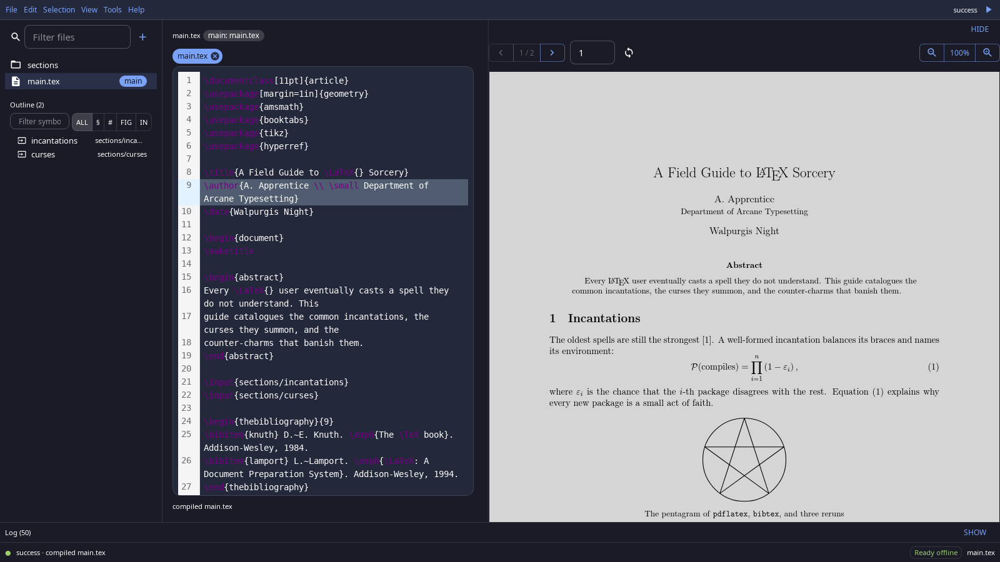
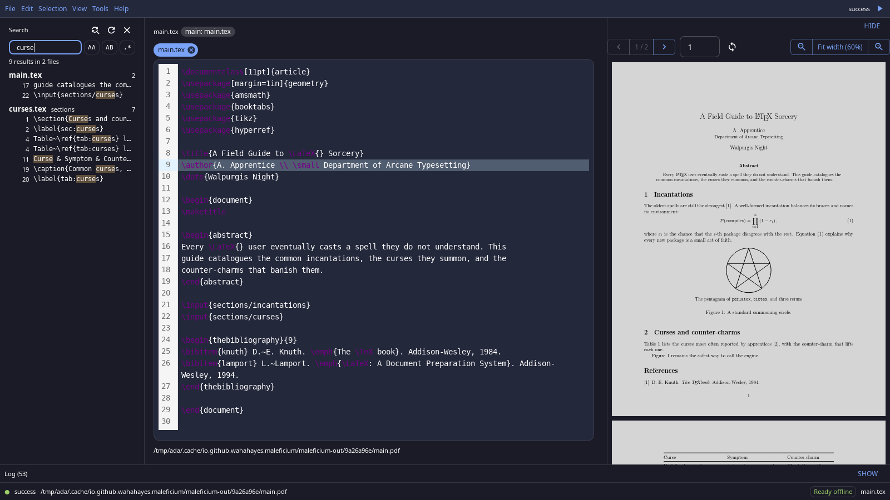
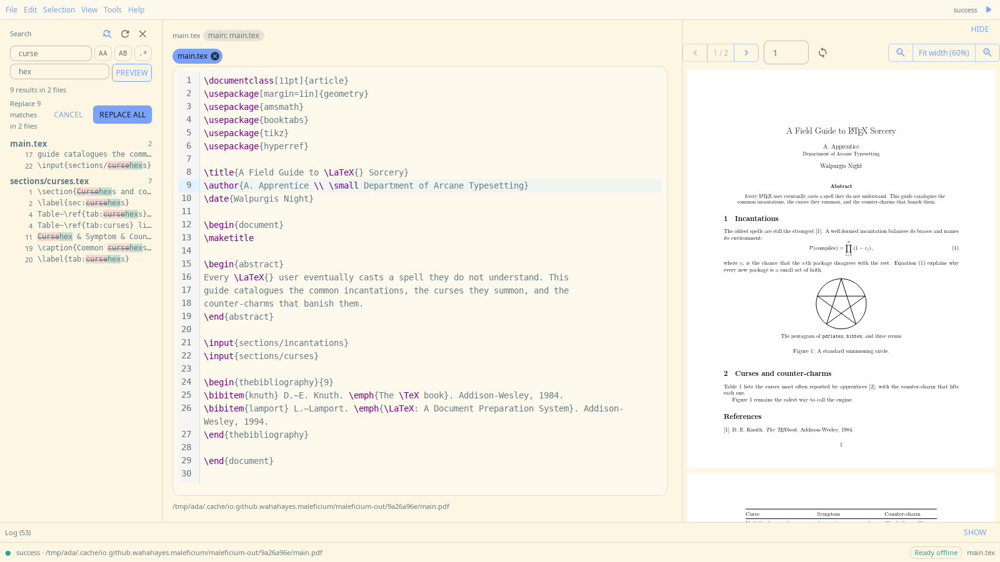

# Maleficium

> **maleficium** _(n.)_: an act of evil sorcery. Also known as debugging LaTeX. This makes the ritual easier.

[](https://m8ven.ai/mcp/wahahayes/maleficium) [](https://m8ven.ai/mcp/wahahayes/maleficium) [](LICENSE)

Maleficium is a LaTeX editor that runs entirely on your machine. Write on one side, read the PDF on the other, and click between them. It ships its own TeX engine, so there is nothing else to install.



## Why Maleficium

**It runs locally.** There's no account, server, or cloud copy. Your projects stay in your own folders, and the app never writes its build files, history, or logs into them. The one thing a compile may add is a `.maleficium/` poster cache, only when your paper uses interactive widgets without a poster of their own (see [Interactive papers](#interactive-papers)). The bundled Tectonic engine downloads its support files on the first compile; after that, everything works offline. That download is the only network traffic the app makes: no telemetry, no auto-updater.

**It's open source, so you can make it yours.** Maleficium is Apache 2.0 and built to be changed at the source: fork it and shape it to the way you work. Menus and the command palette are built from one command registry, so a new action shows up in both from a single entry. A template is just a folder, a color theme is a standard VS Code theme file, and the Rust core behind the editor is the same one its automation tools use. [docs/CONTRIBUTING.md](docs/CONTRIBUTING.md) gets you from clone to running app. No fork needed for the everyday cases: save any project as a template, or import a folder as one, and it joins the gallery beside the CC0 built-ins.

**It's built for working alongside AI agents.** Every action the app and its agents take is written to one shared structured JSONL event log that an agent can read — each line names its actor, and the log keeps the newest 2000 lines. When another process recompiles your document, the preview reloads on its own. The app ships an MCP server, so an agent such as Claude Code can compile, search, replace, and jump through SyncTeX with the same core the editor uses ([Use with an AI agent](#use-with-an-ai-agent)).

## Features

- **Compile with one key.** Ctrl+R compiles with live progress. A pre-compile check lists missing packages, fonts, and tools before the engine trips over them.
- **SyncTeX both ways.** Double-click a line to find it in the PDF; click the PDF to jump back to the source.
- **Find your way around.** File tree, document outline, go to definition for labels, citations, and macros, and a quick file finder (Ctrl+P).
- **Search and replace across the project.** Every replacement is previewed before it is applied, and the whole replace undoes in one step.
- **Revision history.** Every save keeps a revision you can restore (Ctrl+H).
- **Templates and themes.** Nine built-in starter templates, from articles and books to slides and a CV, plus 18 bundled VS Code themes, dark and light.
- **Interactive papers.** Keep the PDF, and also export a web bundle with 3D models, charts, sortable tables and video that opens in any browser ([details](#interactive-papers)).

<p>
  
  
</p>

## Install

Download from the [latest release](https://github.com/wahahayes/maleficium/releases/latest).

### Linux (x86_64)

Debian / Ubuntu:

```sh
sudo apt install ./Maleficium_*_amd64.deb
```

Any other distribution, with the AppImage:

```sh
chmod +x Maleficium_*_amd64.AppImage
./Maleficium_*_amd64.AppImage
```

If the AppImage fails with a FUSE error, run it with `APPIMAGE_EXTRACT_AND_RUN=1` set.

### macOS (preview)

Download the `.dmg` for your Mac: `aarch64` for Apple silicon, `x64` for Intel. Open it and drag Maleficium to Applications.

The app is not signed with an Apple Developer ID yet, so macOS blocks it the first time. Open it once, then go to **System Settings > Privacy & Security** and click **Open Anyway**. If macOS says the app is damaged, clear the download quarantine flag and open it again:

```sh
xattr -dr com.apple.quarantine /Applications/Maleficium.app
```

### Windows (preview)

Download `Maleficium_*_x64-setup.exe` and run it. The installer is not code-signed yet, so SmartScreen warns about an unrecognized app: click **More info**, then **Run anyway**.

### From source

On Linux, Docker builds the `.deb` and AppImage with no toolchain on the host:

```sh
docker build --output type=local,dest=../maleficium-release .
```

To build on the host instead (Linux, macOS, or Windows), install the Node and Rust versions the repo pins, then run `npm ci`, `sh scripts/build-engine.sh`, and `sh scripts/package.sh`; packages land in `out/`. [docs/BUILDING.md](docs/BUILDING.md) lists the system packages each OS needs.

## Getting started

On first launch Maleficium opens a short welcome project. After that:

1. **File > Open Project** (Ctrl+O) opens any folder of `.tex` files, or **File > New Project from Template** starts a new one.
2. Press **Ctrl+R** to compile. Maleficium finds the main file itself. To choose a different one, right-click a `.tex` file in the tree and pick **Set as Main File**.
3. Press **?** to see every keyboard shortcut.

## Interactive papers

A paper can stay a normal LaTeX document that compiles to the PDF a venue wants, and also export to a self-contained web bundle with interactive figures.

1. Every project made from a template already holds `maleficium-interactive.sty`. It is an ordinary file in your project folder, like any package you add yourself, and the project's copy wins over everything else. For an older project, copy the file in next to your main file. A package the TeX bundle lacks is an error that names the file and says to add it to the project folder.
2. Use the macros in your source: `\interactivemodel` (glTF or GLB), `\interactivevideo`, `\interactivetable` (CSV), `\interactivechart` (Vega-Lite) and `\interactive` (a folder of your own HTML). Each needs an `alt=` text. In the PDF each one is its poster, or a placeholder box until it has one. A widget sits on the page colour (white, or your `\pagecolor`); `plate=FFFFFF` gives one widget its own backdrop, in its poster and live in both reader modes.
3. **File > Preview in Browser** opens the bundle in your default browser. **File > Export Paper Bundle** writes it as a folder (for a web server) or as one file (for email, archives, or opening from disk), always outside the project.

**Posters.** A model, chart, or HTML widget without `poster=` gets a poster that Maleficium renders itself. The posters are cached in a `.maleficium/` folder beside your main file, written when you compile. It is safe to delete (the next compile makes the posters again) and you may commit it, so the paper still compiles with its posters without Maleficium. A widget that is new in a compile shows its poster in the same compile: the compile renders the missing poster, then compiles again before handing back the PDF. Video widgets use `poster=` or a placeholder for now.

**Your own HTML widgets need your approval.** A widget folder is code, so Maleficium renders its poster only after you approve that exact content in **View > Widgets**. Any edit asks again, and an AI agent cannot approve for you. An optional auto-approval setting (off by default) approves content changes to a widget you already approved, and new widgets that declare no origins; it never approves a new origin. A widget can declare the `https` origins it may frame or load; see [Embedding a YouTube or Vimeo video](docs/VIDEO-EMBEDS.md).

The bundle's `index.html` is the paper itself, reflowed for the screen: Maleficium converts your LaTeX to HTML (title, authors, abstract, a contents list, sections, math, figures, tables and references) and mounts each widget in place, where it sits in the text. The page has its own look and does not copy your venue's class. `paper.pdf` stays in the bundle as the version of record and a download link; the page does not embed it. Math and macros the converter cannot read show as the raw source on the page and are listed in the export's warnings, and a figure that is missing shows a placeholder. Preview and export never write into your project.

**Styling the page.** The page has a light and a dark mode. A reader picks Auto (their system's), Light or Dark with the button at its top right, and the browser remembers the choice; in the app, the Article tab has the same three choices, where Auto follows the app's theme. To restyle it, name a stylesheet in your project; the PDF never changes:

```latex
\maleficiumreaderstyle{reader.css}
```

```css
/* reader.css: the light mode, then what changes in dark mode */
.m-reader {
  --m-color-bg: #faf3e8;
  --m-color-accent: #7a4a1e;
  --m-color-link: #7a4a1e;
}
.m-reader[data-theme='dark'] {
  --m-color-bg: #221c17;
  --m-color-accent: #d2a679;
  --m-color-link: #d2a679;
}
.m-reader .ltx_title_document {
  color: var(--m-color-accent);
}
```

It is applied after the page's own rules, in the preview and every export. Setting the `--m-*` variables (`--m-color-bg`, `--m-color-text`, `--m-color-accent`, `--m-font-body`, ...) restyles everything that uses them; give both modes a value so neither is left unreadable. Its `url()`s may name fonts and images in the project (relative to the stylesheet), which are inlined so the page still works offline. `@import`, remote or out-of-project `url()`s, and anything that runs script are refused with a warning, and the page keeps its own look.

## Use with an AI agent

Maleficium includes a local [MCP](https://modelcontextprotocol.io) server that speaks over stdio. Start it with `maleficium --mcp`, the app binary with one flag. Linux packages also install it as `maleficium-mcp`; both run the same server. It needs no network beyond the engine's first-compile download, and nothing runs until your agent starts it. See the [privacy policy](PRIVACY.md) for what the server reads, writes, and sends.

Where the command lives:

| Install  | Command                                                                       |
| -------- | ----------------------------------------------------------------------------- |
| `.deb`   | `/usr/bin/maleficium --mcp` (or `/usr/bin/maleficium-mcp`)                    |
| AppImage | `/path/to/Maleficium_<version>_amd64.AppImage --mcp`                          |
| macOS    | `/Applications/Maleficium.app/Contents/MacOS/maleficium --mcp`                |
| Windows  | `%LOCALAPPDATA%\Maleficium\Maleficium.exe --mcp` (the default install folder) |

Point the AppImage entry at wherever you keep the file; its mount point changes on every run, so use the AppImage itself rather than a path inside it. The examples below use the `.deb` path; substitute yours.

**Claude Code:**

```sh
claude mcp add maleficium -- /usr/bin/maleficium --mcp
```

**Claude Desktop** (`claude_desktop_config.json`):

```json
{
  "mcpServers": {
    "maleficium": { "command": "/usr/bin/maleficium", "args": ["--mcp"] }
  }
}
```

**VS Code** (`.vscode/mcp.json` in a workspace, or **MCP: Add Server** from the Command Palette):

```json
{
  "servers": {
    "maleficium": { "type": "stdio", "command": "/usr/bin/maleficium", "args": ["--mcp"] }
  }
}
```

**opencode** (`opencode.json`, or `opencode mcp add maleficium -- /usr/bin/maleficium --mcp`):

```json
{
  "mcp": {
    "servers": {
      "maleficium": { "type": "local", "command": ["/usr/bin/maleficium", "--mcp"] }
    }
  }
}
```

### What the agent can do

The MCP server gives an agent the same core the editor uses: scoped access to a project folder, compile with structured diagnostics, reading (outline, search, references, SyncTeX jumps), cross-file replace with preview and undo, plus export and file operations. It can also see which project your open app window holds, so an agent joins the folder you are already in, and it can ask your window to open a project, which happens only when you click Open. Every tool call is appended to the same event log with actor agent, so the app's log shows what the agent did. Agents write text with their own file tools; the server never puts build files, history, or logs inside the project.

**Keep the app open while the agent works.** When the agent compiles, the PDF preview in an open Maleficium window reloads by itself, so you watch the document change as the agent writes it.

[](https://www.youtube.com/watch?v=Ke4eT5Lx37Q)

## Known limits

- macOS and Windows builds are previews: unsigned, and less tested than Linux.
- No automatic updates. Check the releases page for new versions.
- Until 1.0, settings and history may not carry over between versions.
- The engine is Tectonic only. Documents that need `biber` or shell escape depend on tools outside the app, and the pre-compile check flags them.
- Interactive papers are checked on Linux. Poster rendering on macOS and Windows is untested, and video widgets have no automatic poster.
- Exported paper bundles keep widgets offline, or limited to the origins a widget declares, through the browser's content security policy. Browsers are not egress-proof: some open connections the policy does not stop (preconnects, prerenders), so a bundle limits what loads, not every connection. The app turns WebKit's preconnect off in its own windows on Linux only; macOS and Windows are untested.
- In a single-file bundle a widget can use its declared frame origins only. Declared resource and connect origins take effect in the folder profile ([details](docs/VIDEO-EMBEDS.md)).
- Preview in Browser runs every widget in the paper, html widgets included, without asking for approval. Opening the preview is your explicit action. The approval in View > Widgets gates widget code inside the app, not in a browser.

## Documentation

- [Building from source](docs/BUILDING.md), including how releases are cut
- [Contributing](docs/CONTRIBUTING.md): setup, checks, and house rules
- [Embedding a YouTube or Vimeo video](docs/VIDEO-EMBEDS.md) in a paper bundle, and what it costs
- [Custom widget runtimes](docs/RUNTIMES.md): writing a runtime package for `\interactiveruntime`
- [Test harnesses](e2e/README.md)
- [Built-in templates](src-tauri/templates/README.md): origins and license
- [Privacy](PRIVACY.md): what the app and its MCP server store, read, and send

## Contributing and license

Contributions are welcome; see [docs/CONTRIBUTING.md](docs/CONTRIBUTING.md). Release notes are in [CHANGELOG.md](CHANGELOG.md).

Licensed under Apache 2.0 ([LICENSE](LICENSE)). The built-in templates are CC0, so documents you make from them carry no obligations ([details](src-tauri/templates/README.md)). Bundled third-party themes and engine binaries are credited in [NOTICE](NOTICE).
