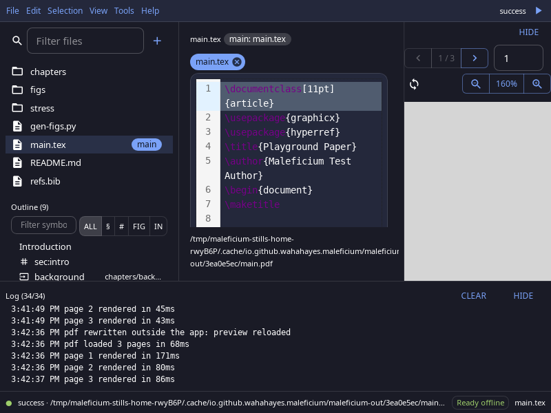
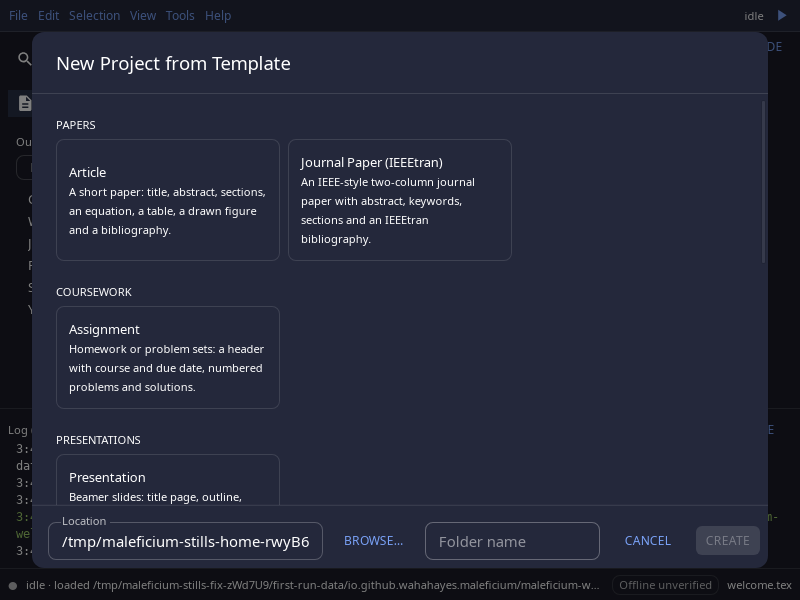
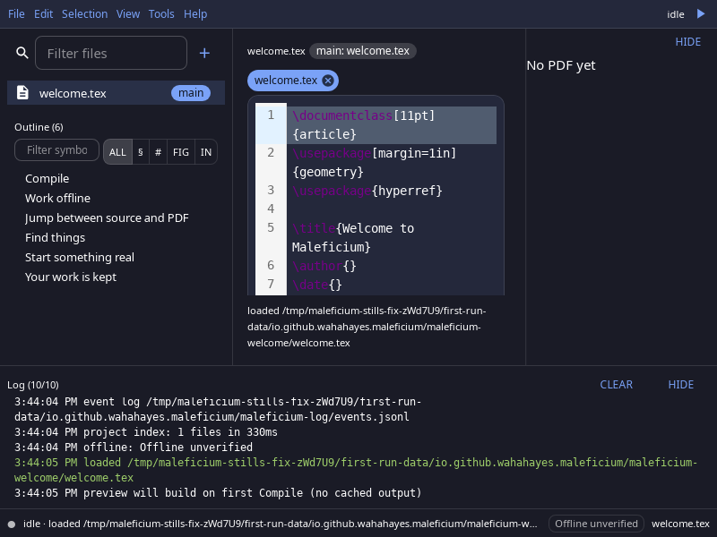

# Maleficium

A desktop LaTeX editor that works offline. Edit on the left, see the PDF on the right, and click between them. Maleficium ships its own TeX engine (Tectonic), so there is no TeX distribution to install.

Linux x86_64 for now. Built with Tauri 2 and Rust, with a React + MUI frontend.



## Features

- **Compile with one key.** Ctrl+R compiles and shows live progress. A pre-compile check lists missing packages, fonts, and tools before the engine hits them.
- **PDF preview with SyncTeX.** Double-click a line to find it in the PDF. Click the PDF to jump back to the source.
- **Project navigation.** File tree, document outline, go to definition for labels, citations, and macros, a quick file finder (Ctrl+P), and a command palette (Ctrl+Shift+P).
- **Search and replace across the project.** Every replacement is shown before it is applied, and the whole replace can be undone in one step.
- **Revision history.** Each save keeps a revision, and any revision can be restored (Ctrl+H). History lives in the app's data folder, never in your project.
- **Templates.** Nine built-in starter templates (article, report, book, presentation, letter, CV, resume, journal paper, assignment), free to use under CC0. You can also save your own.
- **Themes.** Popular VS Code color themes, dark and light, with a searchable picker.



## Install

Download from the [releases page](https://github.com/wahahayes/maleficium/releases).

Debian / Ubuntu:

```sh
sudo apt install ./Maleficium_0.1.0_amd64.deb
```

Any other distribution, with the AppImage:

```sh
chmod +x Maleficium_0.1.0_amd64.AppImage
./Maleficium_0.1.0_amd64.AppImage
```

If the AppImage fails with a FUSE error, run it with `APPIMAGE_EXTRACT_AND_RUN=1` set.

To build it yourself, see [BUILDING.md](BUILDING.md).

## Getting started

On first launch Maleficium opens a short welcome project. After that:

1. **File > Open Project** (Ctrl+O) opens any folder of `.tex` files, or **File > New Project from Template** starts a new one.
2. Press **Ctrl+R** to compile. Maleficium finds the main file itself. To choose a different one, right-click a `.tex` file in the tree and pick **Set as Main File**.
3. Press **?** to see every keyboard shortcut.



## Offline and privacy

The first compile downloads the TeX support files the engine needs, so it needs a network connection. After that Maleficium works fully offline.

That download is the only network traffic the app makes. There is no telemetry and no auto-updater.

## Known limits in 0.1.0

- Linux x86_64 only. macOS and Windows builds will come in a later release.
- No automatic updates. Check the releases page for new versions.
- 0.1.x makes no promise that settings or history carry over between versions.
- The engine is Tectonic only. Documents that need `biber` or shell escape depend on tools outside the app, and the pre-compile check flags them.

## Documentation

- [Building from source](BUILDING.md), including how releases are cut
- [Contributing](CONTRIBUTING.md): setup, checks, and house rules
- [Test harnesses](e2e/README.md)
- [Built-in templates](src-tauri/templates/README.md): origins and license

## Contributing and license

Contributions are welcome; see [CONTRIBUTING.md](CONTRIBUTING.md). Release notes are in [CHANGELOG.md](CHANGELOG.md).

Licensed under Apache 2.0 ([LICENSE](LICENSE)). The built-in templates are CC0, so documents you make from them carry no obligations ([details](src-tauri/templates/README.md)). Bundled third-party themes and engine binaries are credited in [NOTICE](NOTICE).
